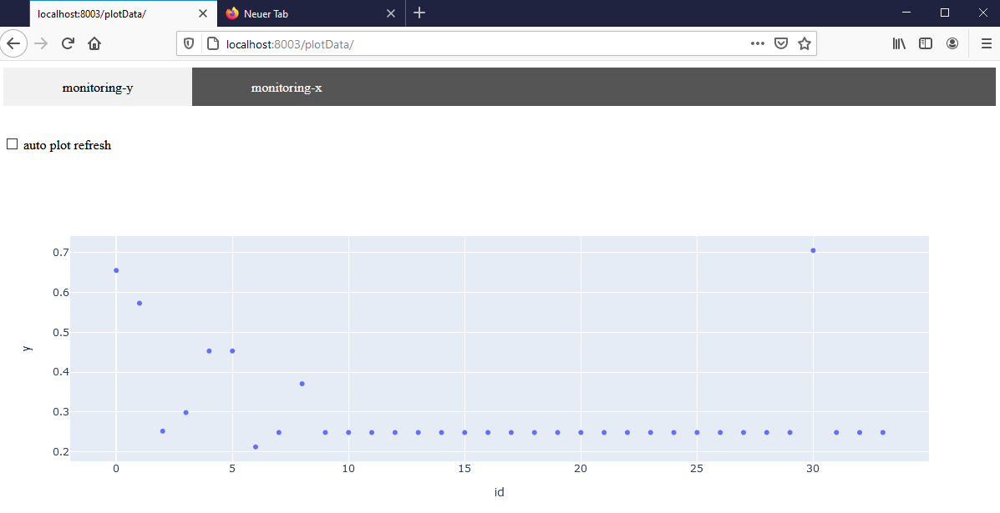
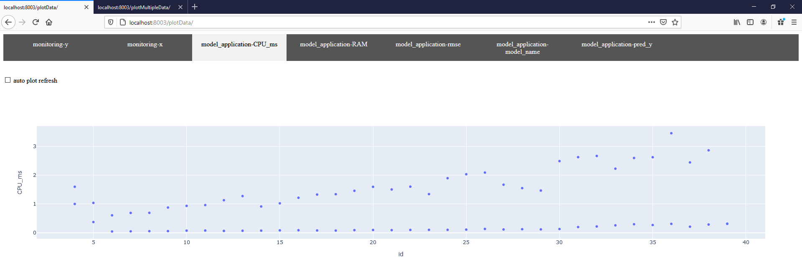
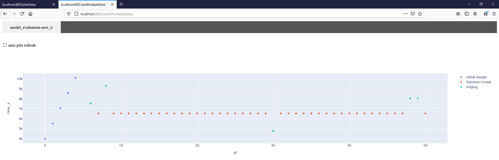
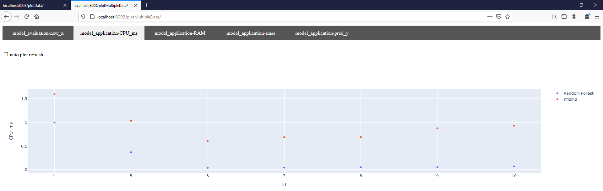

# Preparation
Please install Docker and docker-compose to run the containers.
Instructions can be found [here](https://github.com/janstrohschein/KOARCH/tree/master/Big_Data_Platform/Docker).

Before we start the Kafka broker we create a network, for easier communication between containers, by running this command in a terminal:\
`docker network create caai`

Now you can launch the Kafka broker with the following command:\
`docker-compose -f docker-compose_kafka.yml up`

# Example
The example sends and plots data that was previously captured from the reporting module. Additional functionality will be shown in the following steps. 

## Szenario 1
The example consists of 3 modules:
- L0_P_Send_Data \
  Produces simple messages and publishes those to seperate topics via Kafka. Currently sends only monitoring data, but will be extended during the example.
- L1_C_Reporting\
  Collects the messages from all specified topics, optionally processes the data with specified functions and sends the messages to the plot topic.
- L2_C_Plot_Data\
  Retrieves the messages from the plot topic and creates the plots.
  Currently there is only a single variable plot for the monitoring data. 
  The plot server can be accessed via the browser at:\
  `localhost:8003/plotData`

The results are shown in the figure below:\

The configuration can be done via the `config.yml` and additional transformations of the data within the reporting module `L1_C_Reporting`.
Currently the `config.yml` specifies the outgoing/incoming topic and schema for the monitoring data (line 7 + 13).
Line 20 specifies which function processes the incoming monitoring data.
The associated function in `L1_C_Reporting` decodes the incoming messages, transforms the data into the schema that the plotting module expects, and sends the data to the Kafka topic.

## Szenario 2
Please open `config.yml` and remove the comments from the lines 8, 9, 14, 15, 21 and 22. 
The containers need to be restarted, as shown in the section at the bottom, for the changes to come into effect.

The results are presented in the figures below. 
The first figure shows that the web interface adds new tabs for the additional data sources.\

The second figure displays the first multi-plot.
The plot shows the x-values that have been chosen for each production cycle, but it also groups the data based on another field.\

## Szenario 3
The plotting of the model application data from szenario 2, as shown in the first figure of that szenario, can be enhanced by switching the plot to a multi-plot. 
To achieve this please open the `config.yml` file again and add a comment to line 22 and remove the comment from line 23.
The containers need to be restarted, as shown in the section at the bottom, for the changes to come into effect.

The results are shown in the figure below:\

The multi-plot, as defined in the `L1_C_Reporting` module, now shows the CPU resource usage and groups the results based on the algorithm in use.

Please shutdown all the Docker containers as shown in the section at the end of the readme.

# Restart Docker Containers
- Stop Kafka Container:\
  `ctrl + c`
- Remove Kafka Container:\
  `docker-compose -f docker-compose_kafka.yml down`
- Restart Kafka Container:\
  `docker-compose -f docker-compose_kafka.yml up`
- Stop the Example Containers with:\
  `ctrl + c`
- Remove Example Containers:\
  `docker-compose down`
- Rebuild and start Example Containers:\
  `docker-compose up --build`

# Shutdown Docker Containers
- Stop Kafka Container:\
  `ctrl + c`
- Remove Kafka Container:\
  `docker-compose -f docker-compose_kafka.yml down`
- Stop the Example Containers with:\
  `ctrl + c`
- Remove Example Containers:\
  `docker-compose down`
