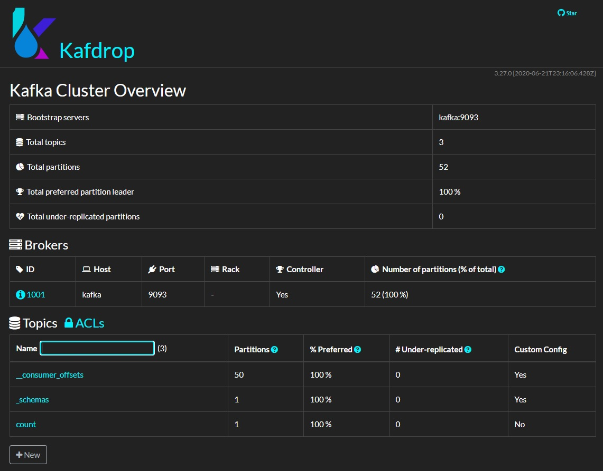

# Kafdrop
[Kafdrop](https://github.com/obsidiandynamics/kafdrop) is an open-source, third-party tool to get additional insights in the Kafka Cluster status.

The tool provides the following features:
+ View Kafka brokers — topic and partition assignments, and controller status
+ View topics — partition count, replication status, and custom configuration
+ Browse messages — JSON, plain text and Avro encoding
+ View consumer groups — per-partition parked offsets, combined and per-partition lag
+ Create new topics
+ View ACLs

The following figure shows the web interface:

# Preparation
Please install Docker and docker-compose to run the containers. 
Instructions can be found [here](https://github.com/janstrohschein/KOARCH/tree/master/Big_Data_Platform/Docker).
Before we start the Kafka broker we create a network, for easier communication between containers, by running this command in a terminal:\
`docker network create caai`

Please make sure that another example is running and there is an observable Kafka Cluster.
You can find another example [here](../Confluent%20Kafka/readme.md). 

# Example
Now you can start  Kafdrop with the following command in a terminal:\
`docker-compose up`

## Web Interface
You can access the Kafdrop web interface via:\
`localhost:9000` or\
`127.0.0.1:9000`

## API Documentation
It is also possible to access Kafdrop via API.
The API documentation can be found at:\
`http://localhost:9000/v2/api-docs` or\
`http://127.0.0.1:9000/v2/api-docs`

# Stop the Container
You can stop the Container with `Ctrl-C` in the terminal.
After the container shut down you can execute the following command to remove the container:\
`docker-compose down`
