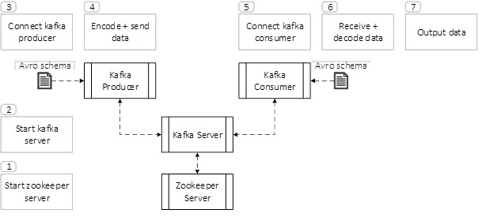

# Kafka
Kafka consists of brokers, producers and consumers. A producer publishes a message to a certain topic and sends it to the broker. A consumer subscribes to a topic and receives incoming messages.

## General Workflow
The figure below depicts the workflow consisting of the following steps: 

1)	Start the Zookeeper server. This handles the orchestration between multiple Kafka Brokers and saves their state. If the restart of Kafka is necessary the last state can be restored so that all messages are processed correctly.
2)	Start the Kafka server. In a message-based infrastructure it is possible to have several Kafka Brokers on the same server or Brokers on multiple servers communicate with each other. 
3)	Connect a Producer to the Broker, new messages can be created from various sources, for example the internet, databases, files or also production systems. 
4)	The communication uses a binary format to encode the messages. Short messages can be encoded without an explicit schema, for bigger messages it is helpful to use an encoder with a schema, for example Avro. Benefits of this approach are message compression and checks of data validity against the schema when it is encoded.
5)	To retrieve and process messages a Consumer can register with the Broker. 
6)	As soon as new messages arrive at the topic the Consumer will collect them and decode the message to restore the values. Therefore the schema that was used to encode the data has to be available to the consumer. 
7)	Now the Consumer can process the data and create an intermediate result for further consumption or a final output.

## Example
Please install Docker and docker-compose to run the containers. 
Instructions can be found [here](https://github.com/janstrohschein/KOARCH/tree/master/Big_Data_Platform/Docker).
Before we start the Kafka broker we create a network, for easier communication between containers, by running this command in a terminal:
`docker network create caai`

Now you can start the Kafka broker with the following command:\
`docker-compose -f docker-compose_kafka.yml up`

This starts the Kafka container and an additional Zookeeper container, which helps Kafka to handle state.
Docker also  opens port 9092 for communication between localhost and the Kafka Broker and 9093 for communication between containers and the Broker.

You can stop the Kafka Broker with `Ctrl-C`.
After the containers stopped you can execute the following command to remove the containers:
`docker-compose -f docker-compose_kafka.yml down`
