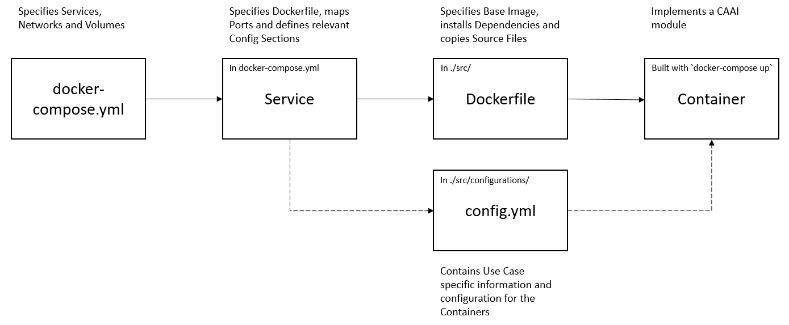

# Big Data Platform in Docker
The components of the big data platform are various software building blocks, each implemented in a Docker container. The goal of the BDP is to provide a modular ecosystem that can be easily extended and adapted to a certain use case. Therefore, messaging is used to publish and subscribe to relevant topics, instead of direct communication of the modules.

## Use Cases
The big data platform on Docker is used in two use cases:
- [Social Media Emotion Detection](Use_Cases/other/Social_Media_Emotion_Detection/readme.md)\
The social media use case collects tweets from Twitter and analyses the text.
This first iteration proves the architectural foundations and shows the containerization and communication of the independent modules.
- [VPS Popcorn Production](Use_Cases/VPS_Popcorn_Production/Docker/readme.md)\
The VPS use case optimizes the production of popcorn through the simultaneous execution and evaluation of several machine learning algorithms.
This second iteration implements the cognition module and several APIs for information storage and retrieval.

# Docker Installation
Please install Docker and docker-compose to run the containers.
You find instructions for the Docker installation on their [website](https://docs.docker.com/get-docker/). 
To test the Docker installation you can open a terminal and execute `docker run hello-world`.

On some OS the Docker installation does not include docker-compose. You can find information for the installation [here](https://docs.docker.com/compose/install/)  in case you get a message that docker-compose is missing.

# Building blocks
The subfolders contain the different building blocks of the Big Data Platform. 
- [Cognition](Cognition/readme.md)\
The Cognition evaluates results of machine learning algorithms on production process information and selects which algorithm provides the parameters for the next production cycle. 
- DB
  - [Postgres](DB/Postgres/readme.md)\
  The relational database stores structured data. 
- HMI
  - [FastAPI](HMI/FastAPI/readme.md)\
  Provides access to data for humans and other systems based on the OpenAPI specification.
  - [Jupyter](HMI/Jupyter/readme.md)\
  The Jupyter datascience notebook includes libraries for data analysis in Julia, Python and R.
- [Kafka](Kafka/readme.md)\
All modules rely on the messaging ability for indirect communication with other modules.
Thus the Kafka building block is the base class for most other modules and more specialized blocks like a connector to PostgresDB inherit the additional Kafka functionality.
- [Knowledge](Knowledge/readme.md)\
The knowledge module is implemented as an API to store, modify and retrieve the knowledge at any time.

# General CAAI Structure
The different building blocks that compose a use case are implemented as Docker container.
Several containers are managed together via docker-compose files.
A docker-compose file contains the information to build the required containers as shown below:



The following folder structure shows all the possible different parts for a building block in this project:

```
Building Block
|- docs
|- src
  |-- classes
  |-- configurations
  |-- schema
  | something.py
  | Dockerfile_something
| docker-compose.yml
| docker-compose_kafka.yml
| readme.md
```

## |- docs
Contains images, diagrams and other supporting material for the documentation.
## |- src
The source folder stores the code files as well as the Dockerfiles.
Dockerfiles consist of instructions to build a container. 
The Dockerfile is named after the module it containerizes. 
### |-- classes
The subfolder contains the different classes, e.g., the Kafka class, for other modules to inherit.
### |-- configurations
The configurations folder stores several files:
- the `config.yml` contains the configuration for all modules in the project. 
  Furthermore, the config file includes general use case specific configuration, e.g., regarding the objective function or the initial design. 
  The description of each service in the docker-compose file specifies which sections of the config file will be used in the container. 
- the `requirements.txt` contains all the packages that need to be installed in a container. 
The Dockerfile copies the file into the container and installs the packages during the build process.
### |-- schema
The modules use indirect communication with a messaging approach.
All messages are send via Kafka and verified with the related Avro schema, which is stored in an `.avsc` file.
Each module specifies its input- and output-topics and the associated schemas in the `config.yml`.
## |- docker-compose files
Several services are combined into a docker-compose file, which allows to manage all services together.
Each service entry consists of:
- the container and host name.
- build information such as the base image or the path to the Dockerfile.
- assign files or volumes from the host system to a specific path in the container file system.
- environment variables, e.g., the config path and the config sections relevant to the module. 
- port forwarding from the host system to the container.

Furthermore it is also possible to define a common network for all containers and to specify how Docker volumes should be used. 

## |- readme
The `readme.md` explains the module/use case and gives usage instructions. 
