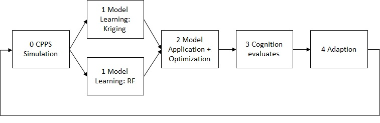

# VPS Popcorn Production Use Case
We use the versatile production system (VPS), which is located in the SmartFactoryOWL, for evaluation of the cognitive component.
The VPS is a modular production system, which processes corn to produce popcorn which is used as packaging material.
Due to its modularity, it can be adapted to the current order easily. 
Efficiently operating the VPS is a challenge because of many parameters influence the result, which cannot be measured inline, e.g., the moisture of the corn.
Thus, a data-driven optimization is a promising method to increase efficiency, which is performed using the CAAI and the introduced cognitive component.

The amount of corn that is filled into the reactor has to be optimized, to get the required amount of popcorn.
The overage of popcorn produced in one batch, or not fully filled boxes cannot be used, so it is waste.
The optimum is a trade-off between three minimization functions: the energy consumption (f1), the processing time (f2), and the amount of corn needed for a small box (f3).
These functions are conflicting to some degree.
The result of the optimization is a parameter value x for the dosing unit that indicated the runtime of the conveyer and thus influence the amount of corn.
As the given optimization problem can be regarded as relatively simple, we will apply a single objective optimization algorithm and compute a weighted sum of the objectives.
This results in the following optimization problem:\

The scalar weights of the corresponding objectives, wi,  are chosen based on user's preferences. 
As a default, equal weights are used.
More details about the use case can be found in [our pre-print](https://arxiv.org/abs/2003.00925). 

Next we would like to present the implementation of our CAAI architecture for this use case.
All modules are implemented as Docker Containers and communicate via Kafka.

# Preparation 
Please install Docker and docker-compose to run the containers.
You find instructions for the Docker installation on their [website](https://docs.docker.com/get-docker/). 
To test the Docker installation you can open a terminal and execute `docker run hello-world`.

On some OS the Docker installation does not include docker-compose. You can find information for the installation [here](https://docs.docker.com/compose/install/)  in case you get a message that docker-compose is missing.

Before we start the Kafka broker we create a network, for easier communication between containers, by running this command in a terminal:
`docker network create caai`

Now you can launch the Kafka broker with the following command:\
`docker-compose -f docker-compose_kafka.yml up`

# Run the experiment
Open another terminal to start the experiment:\
`docker-compose up`

## Start-up
+ You can see the creation of several containers, one for each module of our CAAI pipeline.
+ The start-up sequence starts in the third module, where the Cognition creates the initial design.
The initial design consists of 5 points, equally distributed over the search space for x.
The Cognition publishes those as starting points to the Analytics Bus, where the Adaption (4) listens.
+ The Adaption sends those new parameters to the CPPS Controller (0), where they are retrieved from the CPPS (0) before continuous operation starts.

## Continuous operation
+ The CPPS Module (0) builds a model of the production process with data from experiments on the real CPPS during start-up.
This model is used to evaluate the incoming points for x and derive the corresponding y-value. 
The CPPS (0) sends both points to the Data Bus.
+ As we use message-based communication, we can subscribe any number of modules to a topic and each will receive the data.
In this use case the Monitoring (1) and two Model Learning (1) modules listen to new data from the CPPS (0).
The Monitoring (1) module transfers the CPPS data from the Data Bus to the Analytics Bus, so the Cognition (3) can evaluate the process data.
The Model Learning (1) modules, implementing Kriging and Random Forest algorithms, use leave-one-out cross-validation to calculate RMSE, MAE and R2 and send those metrics as well as the trained model to the Analytics Bus.
+ The Model Application + Optimization (2) module receives both models and uses differential evolution to search for an improved solution.
The best predicted y and the corresponding x for each algorithm is published to the Analytics Bus. 
+ The Cognition (3) is able to evaluate the suggested new values. 
Once the Cognition decided a new value to try in production, it is send to the Adaption (4), which instructs the CPPS controller and concludes the iteration. 

The described workflow is also shown in the figure below:

Please press `Ctrl + C` in each terminal, to stop the experiment as well as the Kafka broker.
Execute both commands to remove the containers:\
`docker-compose down`\
`docker-compose -f docker-compose_kafka.yml down`

# Technical details
A lot of things happened in the background to make this work:
+ Docker-compose builds the Containers from the Dockerfiles in `src`.
+ The Dockerfiles specify the base image, install the requirements found in `./src/configurations/`, copy the sources into the container and set the program to execute when the container starts.
+ The Docker-compose files also specify the path to the configuration file and the relevant sections for each container. 
This sets the environment for the container, e.g. the URL for the Kafka broker, the incoming / outgoing topics for our modules and also the serialization schema.
+ Avro serializes the messages according to schemas defined in `./src/schema/`.
Messages that do not comply to the specified schema raise an error and can´t be send.

