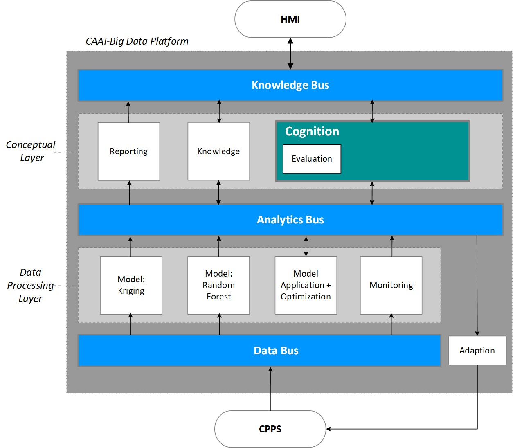
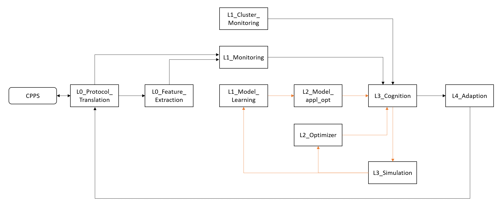
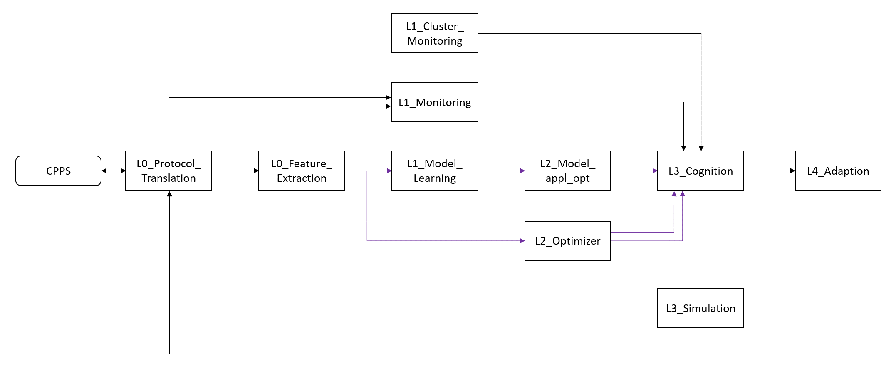
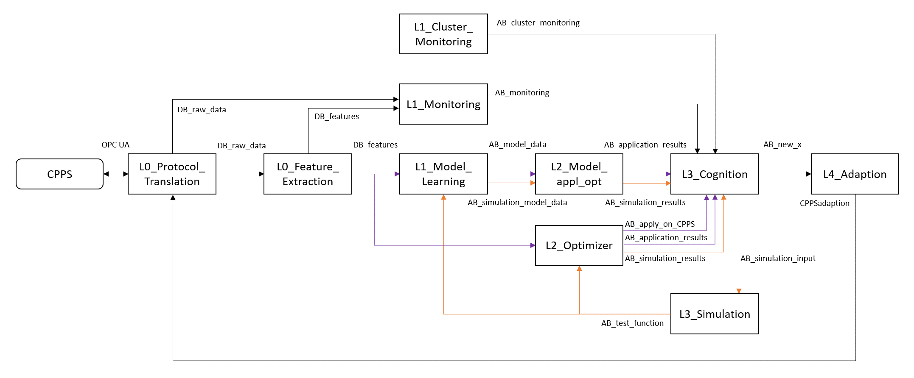
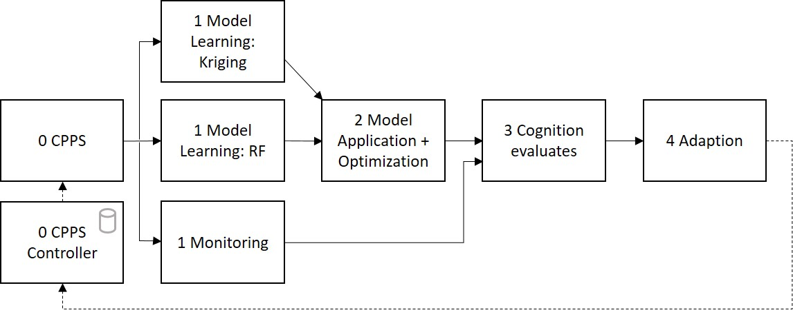
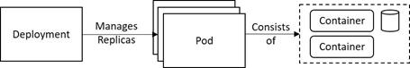
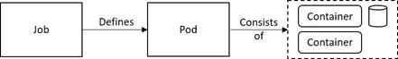
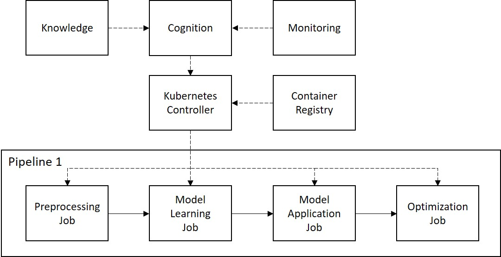

# VPS Popcorn Production (Kubernetes)
We use the versatile production system (VPS), which is located in the SmartFactoryOWL, for evaluation of the cognitive component.
The VPS is a modular production system, which processes corn to produce popcorn which is used as packaging material.
Due to its modularity, it can be adapted to the current order easily.
Efficiently operating the VPS is a challenge because of many parameters influence the result, which cannot be measured inline, e.g., the moisture of the corn.
Thus, a data-driven optimization is a promising method to increase efficiency, which is performed using the CAAI and the introduced cognitive component.

The amount of corn that is filled into the reactor has to be optimized, to get the required amount of popcorn.
The overage of popcorn produced in one batch, or not fully filled boxes cannot be used, so it is waste.
The optimum is a trade-off between three minimization functions: the energy consumption (f1), the processing time (f2), and the amount of corn needed for a small box (f3).
These functions are conflicting to some degree.
The result of the optimization is a parameter value x for the dosing unit that indicated the runtime of the conveyer and thus influence the amount of corn.
As the given optimization problem can be regarded as relatively simple, we will apply a single objective optimization algorithm and compute a weighted sum of the objectives.
This results in the following optimization problem:\

The scalar weights of the corresponding objectives, wi,  are chosen based on user's preferences.
As a default, equal weights are used.
More details about the use case can be found in our publications [here](https://link.springer.com/article/10.1007/s00170-020-06094-z) and [here](https://link.springer.com/article/10.1007%2Fs00170-021-07248-3).

The specific architecture for this use case is displayed in the diagram below:

Next we would like to present the implementation of our CAAI architecture for this use case.
All modules are implemented as Docker Containers and communicate via Kafka.

# Preparation
Please follow our instructions [here](../../../Big_Data_Platform/Kubernetes/readme.md) and [here](../../../Big_Data_Platform/Kubernetes/Kafka_Broker/readme.md) to install the Kubernetes cluster and the required tools.

# Run the experiment

Create a ConfigMap `vps-use-case` with the folder content:
- `kubectl create configmap vps-use-case --from-file=./src/configurations/config_maps`

Create a Service Account with the necessary rights for the Cognition:
- `kubectl apply -f cognition_preparation_custom_service_account.yaml`

Deploy the experiment onto the cluster:
- `kubectl apply -f kubernetes_deployment.yml`

## Simulation

## Production

## Overview

## Access to additional information
While the experiment is running, the user can retrieve additional information through various APIs:

+ Cognition API\
The Cognition stores the most recent values for all production parameters.\
`localhost:8080/cognition/docs`
- Knowledge API\
The knowledge module provides the use case information as well as the algorithm knowledge.
To access the HMI please visit: \
`localhost:8080/knowledge_api/docs`
+ Reporting API\
The reporting module collects data from several topics and forwards the messages to the HMI module.
There the user can retrieve all information or a filtered subset based on the topic as JSON or CSV.
To access the HMI please visit: \
`localhost:8080/topic_data/docs`

## Stop the experiment

Remove the deployment from the cluster:
- `kubectl apply -f kubernetes_deployment.yml`

Remove the Cognition Service Account:
+ `kubectl apply -f cognition_preparation_custom_service_account.yaml`

Remove the ConfigMap `vps-use-case`:
- `kubectl delete configmap vps-use-case`

#TODO Describe experiment
<!---
Open another terminal to start the experiment:\
`docker-compose up`

## Start-up
+ You can see the creation of several containers, one for each module of our CAAI pipeline.
+ The start-up sequence starts in the third module, where the Cognition creates the initial design.
The initial design consists of 5 points, equally distributed over the search space for x.
The Cognition publishes those as starting points to the Analytics Bus, where the Adaption (4) listens.
+ The Adaption sends those new parameters to the CPPS Controller (0), where they are retrieved from the CPPS (0) before continuous operation starts.

## Continuous operation
+ The CPPS Module (0) builds a model of the production process with data from experiments on the real CPPS during start-up.
This model is used to evaluate the incoming points for x and derive the corresponding y-value.
The CPPS (0) sends both points to the Data Bus.
+ As we use message-based communication, we can subscribe any number of modules to a topic and each will receive the data.
In this use case the Monitoring (1) and two Model Learning (1) modules listen to new data from the CPPS (0).
The Monitoring (1) module transfers the CPPS data from the Data Bus to the Analytics Bus, so the Cognition (3) can evaluate the process data.
The Model Learning (1) modules, implementing Kriging and Random Forest algorithms, use leave-one-out cross-validation to calculate RMSE, MAE and R2 and send those metrics as well as the trained model to the Analytics Bus.
+ The Model Application + Optimization (2) module receives both models and uses differential evolution to search for an improved solution.
The best predicted y and the corresponding x for each algorithm is published to the Analytics Bus.
+ The Cognition (3) is able to evaluate the suggested new values.
Once the Cognition decided a new value to try in production, it is send to the Adaption (4), which instructs the CPPS controller and concludes the iteration.

The described workflow is also shown in the figure below:

-->
# Experiment results
The detailed results for the experiment can be found [here](experiments/readme.md).

# Technical details

## Kubenetes Deployments
A deployment is used for all modules of the BDP that require continuous operation, e.g., the cognitive module, the knowledgebase, or also the messaging solution.
A deployment, as shown below, specifies the number of replicas of a pod, which the Kubernetes controller instantiates and monitors on the available nodes in the cluster. The controller will start new instances if a single pod or a complete node fails to reach the desired deployment state for the Kubernetes cluster.

## Kubernetes Jobs

The job is meant for one-off execution of a task, e.g., a part of a data processing pipeline. A job, as seen in the figure below, defines a pod and the desired amount of parallelism or the number of allowed retries, if the job fails during execution. The Kubernetes controller will track the job progress and manage the whole job lifecycle to free up resources after completion.

## Dynamic Job Instantiation
An overview of the complete process to dynamically create a data processing pipeline is depicted in the figure below. The cognitive component decides which algorithms should be tested on the current use case based on information about available cluster resources from the monitoring module and the knowledge on available algorithms and their properties. The cognition then declares which jobs need to run to form one or more data processing pipelines. The controller subsequently pulls the container images for the given jobs from the container registry and instantiates them.

