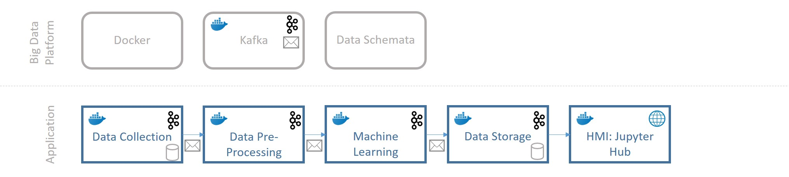

# Introduction

This use case implements a first prototype of our big data platform and uses an automated approach to study the emotions of a larger group of social media users on Twitter over time. It is possible to extract emotions from the text of their status updates as shown by Tasoulis et al. and Colneric and Demsar ([Tasoulis et al., 2018](https://arxiv.org/abs/1804.00482), [Colneric & Demsar, 2018](https://ieeexplore.ieee.org/document/8295234)). This analysis is based on the work of Colneric and Demsar ([github](https://github.com/nikicc/twitter-emotion-recognition)) and investigates if the emotions of users or groups of users become more negative over time as suggested by other studies.

# Big Data Platform

The platform uses Docker and Kafka to implement the applications as microservices with communication capabilities. Data schemata specify the interfaces between applications and ensure data quality. 



# Workflow

1. Connect to twitter and retrieve users in the U.S.A., who published a status update at a trending topic, as well as their followers. The users are persisted in "User DB". 
2. Collect the tweets from all users. The twitter API allows to download roughly the last 3.200 tweets. 
3. Implements Colneric and Demsars pre-trained RNN in several instances to classify the text of each tweet in parallel and retrieve values for each emotion. 
4. Receives the classifications from all instances and persists them to "User Emotions DB". 
5. Jupyter Hub enables the interactive analysis in the browser.


# Preparation
The implementation consists of several Docker containers, so please install Docker and docker-compose. 
Instructions can be found [here](https://github.com/janstrohschein/KOARCH/tree/master/Big_Data_Platform/Docker).
It is also required to create a Twitter developer account at [Twitter Dev Website](https://developer.twitter.com/en/apply-for-access) and enter the credentials in "./src/configurations/twitter.ini". Afterwards open a console and execute the following commands:

- Create Docker Network
  
  ```
  create network emotion-detection
  ```
  
- Create Docker Volumes
  
  ```
  create volume 1c_postgres_volume
  create volume 3c_postgres_volume
  ```
  
- Initialize Postgres DBs
  
  - Execute the Docker Compose script to initialize the DBs
    
    ```
    docker-compose -f docker-compose_init_dbs.yml up --build -d
    ```
  
  - Check if the DB initialization was successful
    
    - connect to first Postgres instance on Port 54321
    
      ```
      psql -h localhost -p 54321 -U postgres
      ```
    
    - show table definition for "Twitter Users"
    
      ```
      \dt
      ```
    
    - close psql
    
      ```
      \q
      ```
    
    - repeat for second instance on Port 54323 to check the "Twitter Updates" table
    
      ```
      psql -h localhost -p 54323 -U postgres
      \dt
      \q
      ```
    
  - Stop the DB containers
  
    ```
    docker-compose -f docker-compose_init_dbs.yml down
    ```
  
- Start Kafka Containers

  ```
  docker-compose -f docker-compose_kafka.yml up --build -d
  ```

# Collect tweets and classifications

- Use Docker Compose to start the pipeline
  
  ```
  docker-compose up --build -d
  ```
  
- check for incoming data points in PostgresDB "User DB"
  
  - connect to DB
  
    ```
    psql -h localhost -p 54321 -U postgres
    ```
  
  - show the number of users in the DB
  
    ```
    select count(*) from twitter_users;
    ```
  
  - show the users and their statistics, press "q" to close the result screen
  
    ```
    select * from twitter_users;
    ```
  
  - close psql
  
    ```
    \q
    ```

# Analysis

The data can be analyzed in a Jupyter Notebook. We provide a sample notebook, but you can add notebooks in Python, R or Julia. 

- Start the Jupyter Hub Container

  ```
  docker-compose -f docker-compose_jupyter.yml -d
  ```

- Open Jupyter Hub in your browser at localhost:8888